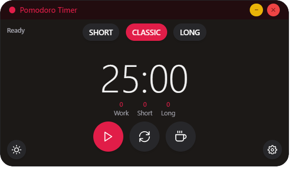

<div align="center">

# EyeP👀


</div>

<div align="center">

</div>

**EyeP** is a modern Pomodoro timer application built with **Electron**, **React**, and **TypeScript**. It helps you stay productive by managing your work and break intervals effectively. The application also includes advanced features like emotion tracking, cursor tracking, and system tray integration.

---

## Features ✨

- ⏱️ **Pomodoro Timer**: Manage your work and break intervals with ease.
- 😊 **Emotion Tracking**: Monitor your emotions during work sessions.
- 🖱️ **Cursor Tracking**: Track cursor activity to analyze productivity.
- 🖥️ **System Tray Integration**: Minimize the app to the system tray for seamless background operation.
- 🌍 **Cross-Platform**: Available for Windows, macOS, and Linux.
- 🪟 **Customizable Transparency**: Toggle window transparency for a distraction-free experience.

---

## Screenshots 📸

<div align="center">

</div>

<div align="center">


</div>

---

## Download 🚀

You can download the latest version of **EyeP** from the [Releases Page](https://github.com/mafifa/eyep/releases).

---

## File Structure 📂

```plaintext
├── build/                  # Build resources (icons, entitlements, etc.)
├── src/                    # Source code
│   ├── main/               # Main process code
│   ├── preload/            # Preload scripts
│   ├── renderer/           # Renderer process code
├── .vscode/                # VSCode configuration
├── electron-builder.yml    # Electron Builder configuration
├── package.json            # Project metadata and scripts
└── README.md               # Project documentation
```

GitHub Copilot
Aquí tienes el README actualizado con las modificaciones solicitadas, manteniendo la sección de estructura de archivos:

# Contributing 🤝

We welcome contributions! Follow these simple steps:

- 🍴 Fork the repository.
- 🛠️ Make your changes in a new branch.
- 📥 Submit a pull request with a clear description of your changes.

<div align="center">

### **Enjoy using EyeP! 🎉**

</div>
